# 区块链钱包收款方案架构设计

## 目录
- [方案一：交易所EOA地址方案](#方案一交易所eoa地址方案)
- [方案二：CREATE2合约地址方案](#方案二create2合约地址方案)
- [方案三：EIP-402支付协议方案](#方案三eip-402支付协议方案)
- [方案对比](#方案对比)

---

## 方案一：交易所EOA地址方案

### 整体架构图

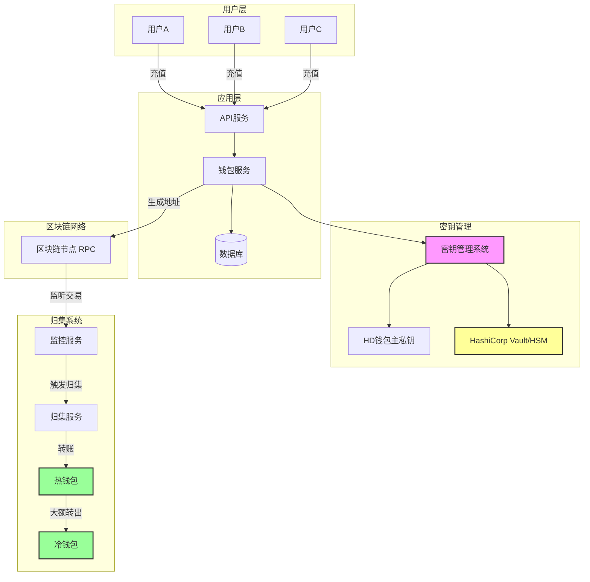
```mermaid
graph TB
    subgraph "用户层"
        U1[用户A]
        U2[用户B]
        U3[用户C]
    end

    subgraph "应用层"
        API[API服务]
        WS[钱包服务]
        DB[(数据库)]
    end

    subgraph "密钥管理"
        KMS[密钥管理系统]
        HD[HD钱包主私钥]
        VAULT[HashiCorp Vault/HSM]
    end

    subgraph "区块链网络"
        BC[区块链节点 RPC]
    end

    subgraph "归集系统"
        MON[监控服务]
        COLL[归集服务]
        HOT[热钱包]
        COLD[冷钱包]
    end

    U1 -->|充值| API
    U2 -->|充值| API
    U3 -->|充值| API
    
    API --> WS
    WS --> DB
    WS --> KMS
    KMS --> VAULT
    KMS --> HD
    
    WS -->|生成地址| BC
    
    BC -->|监听交易| MON
    MON -->|触发归集| COLL
    COLL -->|转账| HOT
    HOT -->|大额转出| COLD
    
    style KMS fill:#f9f,stroke:#333,stroke-width:2px
    style VAULT fill:#ff9,stroke:#333,stroke-width:2px
    style HOT fill:#9f9,stroke:#333,stroke-width:2px
    style COLD fill:#9f9,stroke:#333,stroke-width:2px
```

### 地址生成流程

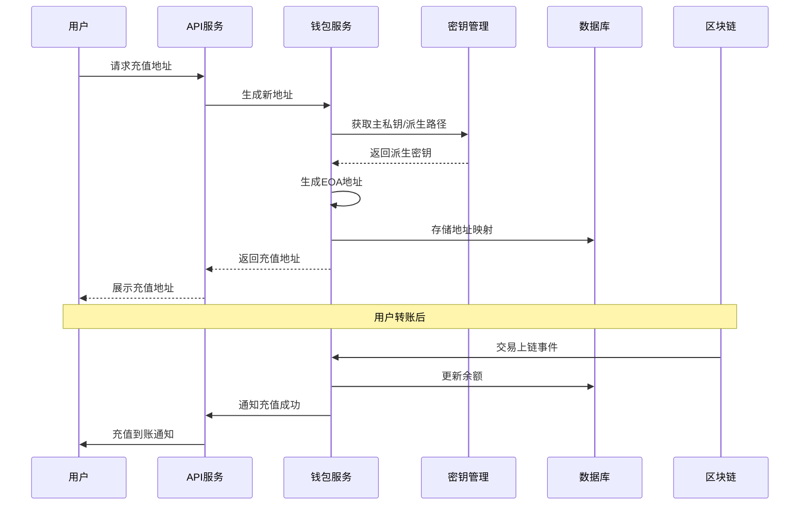
```mermaid
sequenceDiagram
    participant U as 用户
    participant API as API服务
    participant WS as 钱包服务
    participant KMS as 密钥管理
    participant DB as 数据库
    participant BC as 区块链

    U->>API: 请求充值地址
    API->>WS: 生成新地址
    WS->>KMS: 获取主私钥/派生路径
    KMS-->>WS: 返回派生密钥
    WS->>WS: 生成EOA地址
    WS->>DB: 存储地址映射
    WS-->>API: 返回充值地址
    API-->>U: 展示充值地址
    
    Note over U,BC: 用户转账后
    
    BC->>WS: 交易上链事件
    WS->>DB: 更新余额
    WS->>API: 通知充值成功
    API->>U: 充值到账通知
```

### 归集流程

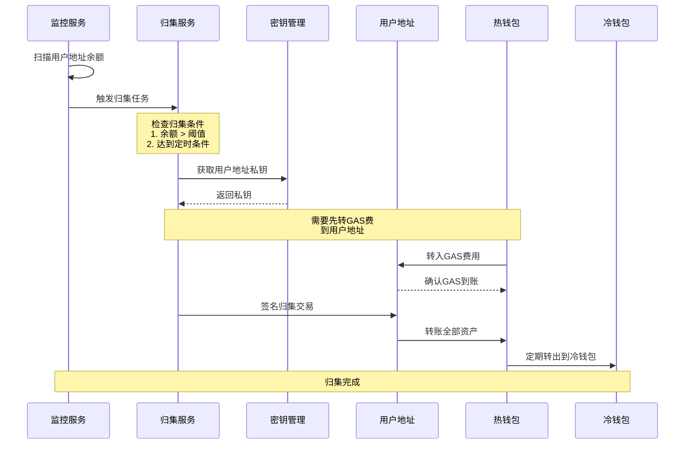
```mermaid
sequenceDiagram
    participant MON as 监控服务
    participant COLL as 归集服务
    participant KMS as 密钥管理
    participant UA as 用户地址
    participant HW as 热钱包
    participant CW as 冷钱包

    MON->>MON: 扫描用户地址余额
    MON->>COLL: 触发归集任务
    
    Note over COLL: 检查归集条件<br/>1. 余额 > 阈值<br/>2. 达到定时条件
    
    COLL->>KMS: 获取用户地址私钥
    KMS-->>COLL: 返回私钥
    
    Note over COLL,HW: 需要先转GAS费<br/>到用户地址
    
    HW->>UA: 转入GAS费用
    UA-->>HW: 确认GAS到账
    
    COLL->>UA: 签名归集交易
    UA->>HW: 转账全部资产
    HW->>CW: 定期转出到冷钱包
    
    Note over MON,CW: 归集完成
```

### 系统组件详解

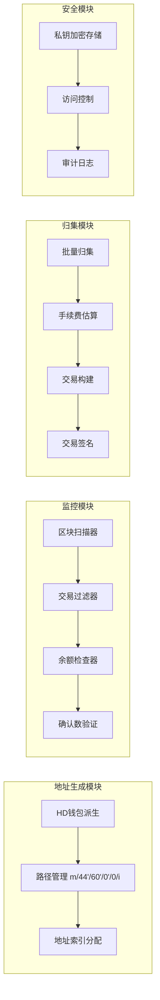
```mermaid
graph LR
    subgraph "地址生成模块"
        A1[HD钱包派生]
        A2[路径管理 m/44'/60'/0'/0/i]
        A3[地址索引分配]
    end

    subgraph "监控模块"
        M1[区块扫描器]
        M2[交易过滤器]
        M3[余额检查器]
        M4[确认数验证]
    end

    subgraph "归集模块"
        C1[批量归集]
        C2[手续费估算]
        C3[交易构建]
        C4[交易签名]
    end

    subgraph "安全模块"
        S1[私钥加密存储]
        S2[访问控制]
        S3[审计日志]
    end

    A1 --> A2 --> A3
    M1 --> M2 --> M3 --> M4
    C1 --> C2 --> C3 --> C4
    S1 --> S2 --> S3
```

---

## 方案二：CREATE2合约地址方案

### 整体架构图

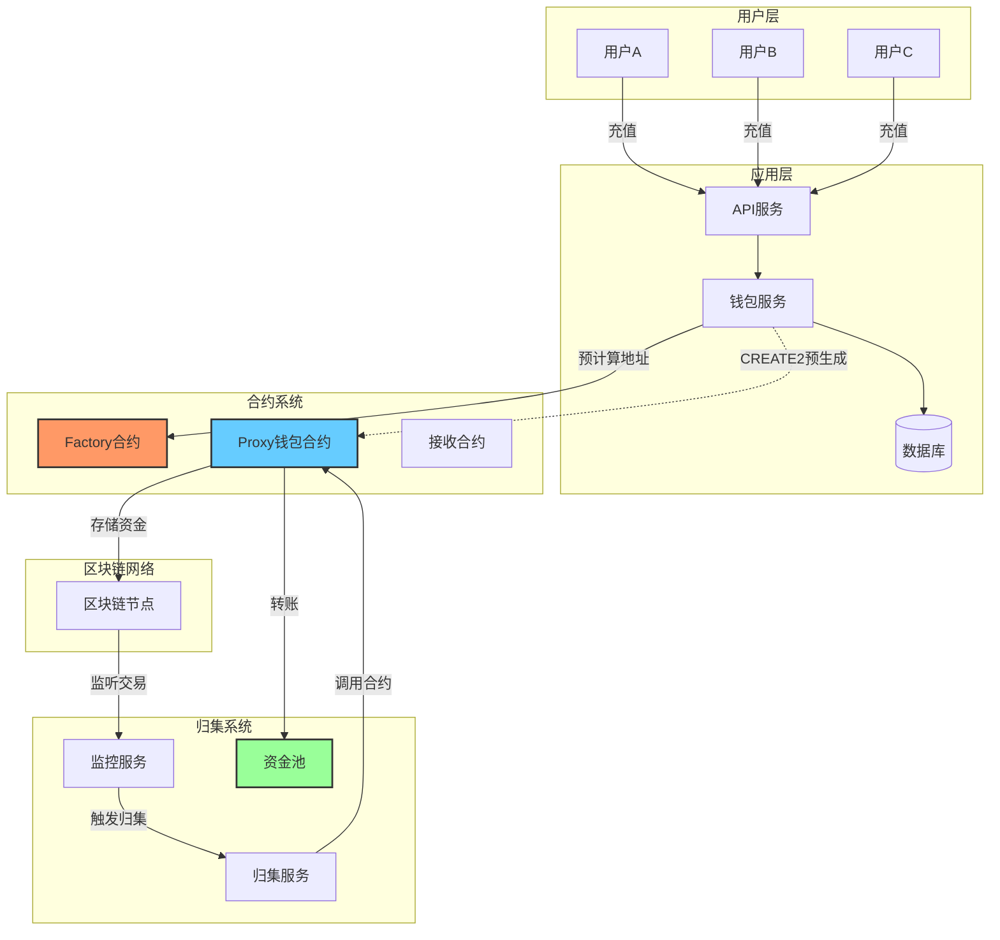
```mermaid
graph TB
    subgraph "用户层"
        U1[用户A]
        U2[用户B]
        U3[用户C]
    end

    subgraph "应用层"
        API[API服务]
        WS[钱包服务]
        DB[(数据库)]
    end

    subgraph "合约系统"
        FACTORY[Factory合约]
        PROXY[Proxy钱包合约]
        RECEIVER[接收合约]
    end

    subgraph "区块链网络"
        BC[区块链节点]
    end

    subgraph "归集系统"
        MON[监控服务]
        COLL[归集服务]
        TREASURY[资金池]
    end

    U1 -->|充值| API
    U2 -->|充值| API
    U3 -->|充值| API
    
    API --> WS
    WS --> DB
    WS -->|预计算地址| FACTORY
    WS -.->|CREATE2预生成| PROXY
    
    PROXY -->|存储资金| BC
    BC -->|监听交易| MON
    
    MON -->|触发归集| COLL
    COLL -->|调用合约| PROXY
    PROXY -->|转账| TREASURY
    
    style FACTORY fill:#f96,stroke:#333,stroke-width:2px
    style PROXY fill:#6cf,stroke:#333,stroke-width:2px
    style TREASURY fill:#9f9,stroke:#333,stroke-width:2px
```

### CREATE2地址预计算原理

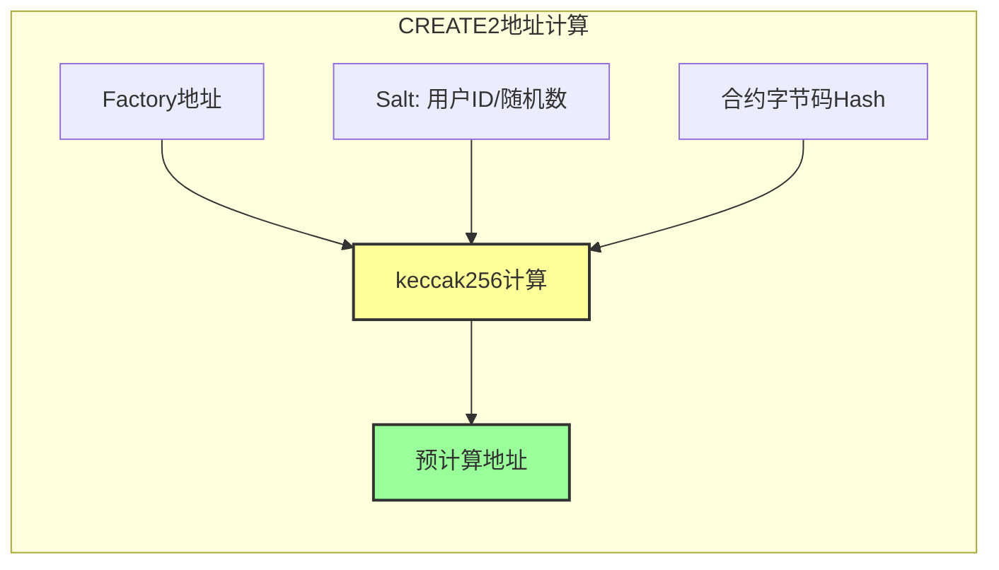
```mermaid
graph LR
    subgraph "CREATE2地址计算"
        A[Factory地址] --> C
        B[Salt: 用户ID/随机数] --> C
        D[合约字节码Hash] --> C
        C[keccak256计算] --> E[预计算地址]
    end
    
    style C fill:#ff9,stroke:#333,stroke-width:2px
    style E fill:#9f9,stroke:#333,stroke-width:2px
```

### 合约部署与归集流程

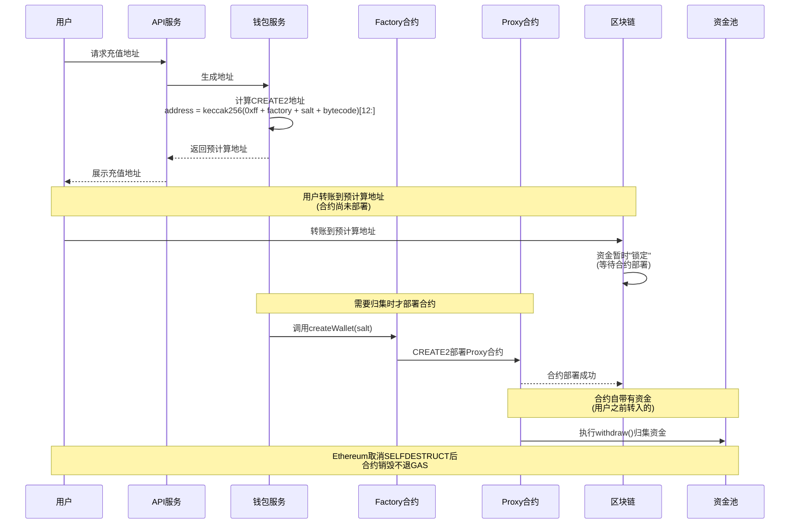
```mermaid
sequenceDiagram
    participant U as 用户
    participant API as API服务
    participant WS as 钱包服务
    participant FC as Factory合约
    participant PC as Proxy合约
    participant BC as 区块链
    participant TR as 资金池

    U->>API: 请求充值地址
    API->>WS: 生成地址
    WS->>WS: 计算CREATE2地址<br/>address = keccak256(0xff + factory + salt + bytecode)[12:]
    WS-->>API: 返回预计算地址
    API-->>U: 展示充值地址
    
    Note over U,BC: 用户转账到预计算地址<br/>(合约尚未部署)
    
    U->>BC: 转账到预计算地址
    BC->>BC: 资金暂时"锁定"<br/>(等待合约部署)
    
    Note over WS,PC: 需要归集时才部署合约
    
    WS->>FC: 调用createWallet(salt)
    FC->>PC: CREATE2部署Proxy合约
    PC-->>BC: 合约部署成功
    
    Note over PC,TR: 合约自带有资金<br/>(用户之前转入的)
    
    PC->>TR: 执行withdraw()归集资金
    
    Note over U,TR: Ethereum取消SELFDESTRUCT后<br/>合约销毁不退GAS
```

### Proxy钱包合约架构

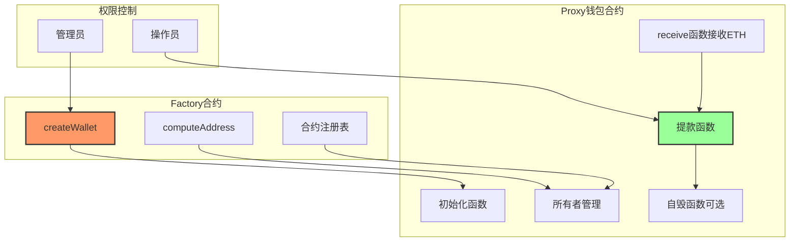
```mermaid
graph TB
    subgraph "Proxy钱包合约"
        INIT[初始化函数]
        OWNER[所有者管理]
        RECEIVE[receive函数接收ETH]
        WITHDRAW[提款函数]
        DESTROY[自毁函数可选]
    end

    subgraph "Factory合约"
        CREATE[createWallet]
        COMPUTE[computeAddress]
        REGISTRY[合约注册表]
    end

    subgraph "权限控制"
        ADMIN[管理员]
        OPERATOR[操作员]
    end

    CREATE --> INIT
    COMPUTE --> OWNER
    REGISTRY --> OWNER
    
    RECEIVE --> WITHDRAW
    WITHDRAW --> DESTROY
    
    ADMIN --> CREATE
    OPERATOR --> WITHDRAW
    
    style CREATE fill:#f96,stroke:#333,stroke-width:2px
    style WITHDRAW fill:#9f9,stroke:#333,stroke-width:2px
```

### 归集触发机制

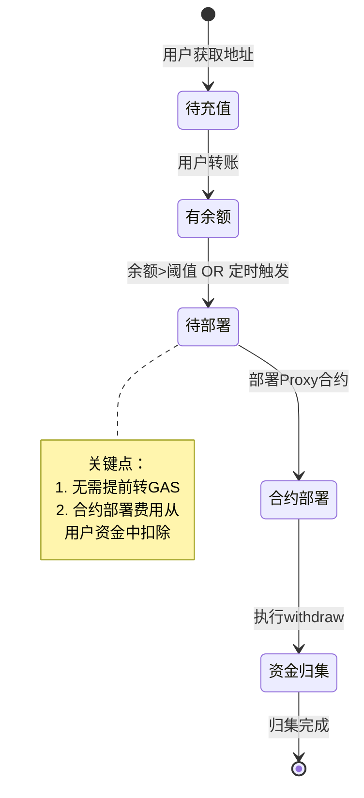
```mermaid
stateDiagram-v2
    [*] --> 待充值: 用户获取地址
    待充值 --> 有余额: 用户转账
    有余额 --> 待部署: 余额>阈值 OR 定时触发
    待部署 --> 合约部署: 部署Proxy合约
    合约部署 --> 资金归集: 执行withdraw
    资金归集 --> [*]: 归集完成
    
    note right of 待部署
        关键点：
        1. 无需提前转GAS
        2. 合约部署费用从
           用户资金中扣除
    end note
```

---

## 方案三：EIP-402支付协议方案

> **EIP-402** 是基于HTTP 402 Payment Required状态码的Web3支付协议，用户通过钱包直接支付来访问服务或完成充值。

### 整体架构图

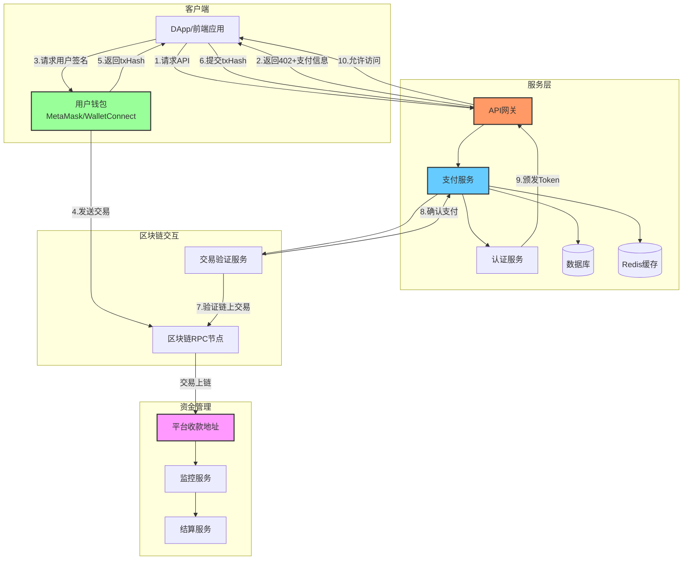
```mermaid
graph TB
    subgraph "客户端"
        DAPP[DApp/前端应用]
        WALLET[用户钱包<br/>MetaMask/WalletConnect]
    end

    subgraph "服务层"
        GW[API网关]
        PAY[支付服务]
        AUTH[认证服务]
        DB[(数据库)]
        CACHE[(Redis缓存)]
    end

    subgraph "区块链交互"
        RPC[区块链RPC节点]
        VERIFY[交易验证服务]
    end

    subgraph "资金管理"
        TREASURY[平台收款地址]
        MON[监控服务]
        SETTLE[结算服务]
    end

    DAPP -->|1.请求API| GW
    GW -->|2.返回402+支付信息| DAPP
    DAPP -->|3.请求用户签名| WALLET
    WALLET -->|4.发送交易| RPC
    WALLET -->|5.返回txHash| DAPP
    DAPP -->|6.提交txHash| GW
    GW --> PAY
    PAY --> VERIFY
    VERIFY -->|7.验证链上交易| RPC
    VERIFY -->|8.确认支付| PAY
    PAY --> AUTH
    AUTH -->|9.颁发Token| GW
    GW -->|10.允许访问| DAPP
    PAY --> DB
    PAY --> CACHE
    
    RPC -->|交易上链| TREASURY
    TREASURY --> MON
    MON --> SETTLE
    
    style GW fill:#f96,stroke:#333,stroke-width:2px
    style PAY fill:#6cf,stroke:#333,stroke-width:2px
    style WALLET fill:#9f9,stroke:#333,stroke-width:2px
    style TREASURY fill:#f9f,stroke:#333,stroke-width:2px
```

### 支付请求流程

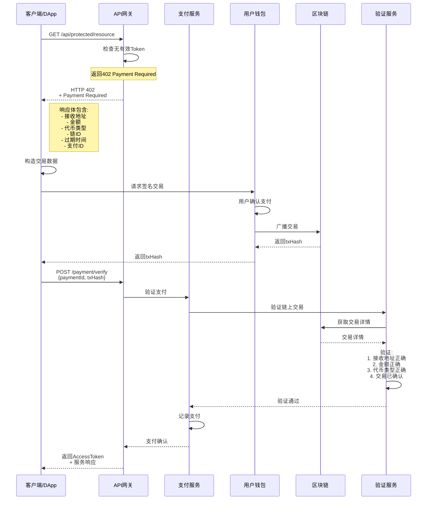
```mermaid
sequenceDiagram
    participant C as 客户端/DApp
    participant GW as API网关
    participant PS as 支付服务
    participant W as 用户钱包
    participant BC as 区块链
    participant VS as 验证服务

    C->>GW: GET /api/protected/resource
    GW->>GW: 检查无有效Token
    
    Note over GW: 返回402 Payment Required
    
    GW-->>C: HTTP 402<br/>+ Payment Required
    Note right of C: 响应体包含:<br/>- 接收地址<br/>- 金额<br/>- 代币类型<br/>- 链ID<br/>- 过期时间<br/>- 支付ID

    C->>C: 构造交易数据
    C->>W: 请求签名交易
    W->>W: 用户确认支付
    W->>BC: 广播交易
    BC-->>W: 返回txHash
    W-->>C: 返回txHash
    
    C->>GW: POST /payment/verify<br/>{paymentId, txHash}
    GW->>PS: 验证支付
    PS->>VS: 验证链上交易
    VS->>BC: 获取交易详情
    
    BC-->>VS: 交易详情
    VS->>VS: 验证:<br/>1. 接收地址正确<br/>2. 金额正确<br/>3. 代币类型正确<br/>4. 交易已确认
    
    VS-->>PS: 验证通过
    PS->>PS: 记录支付
    PS-->>GW: 支付确认
    GW-->>C: 返回AccessToken<br/>+ 服务响应
```

### 402响应数据结构

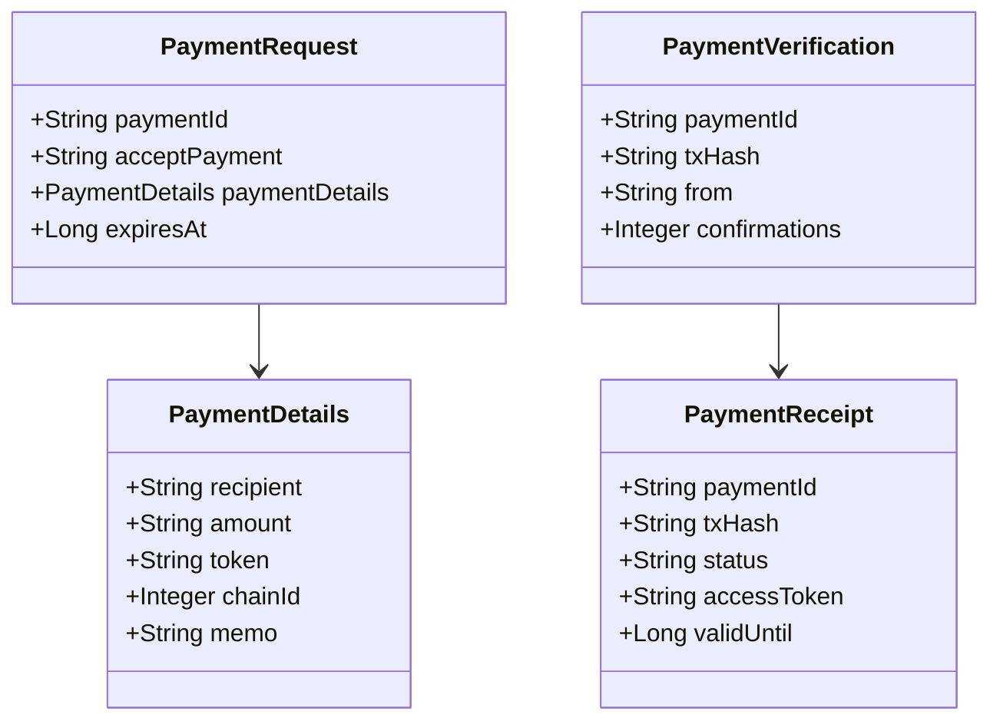
```mermaid
classDiagram
    class PaymentRequest {
        +String paymentId
        +String acceptPayment
        +PaymentDetails paymentDetails
        +Long expiresAt
    }
    
    class PaymentDetails {
        +String recipient
        +String amount
        +String token
        +Integer chainId
        +String memo
    }
    
    class PaymentVerification {
        +String paymentId
        +String txHash
        +String from
        +Integer confirmations
    }
    
    class PaymentReceipt {
        +String paymentId
        +String txHash
        +String status
        +String accessToken
        +Long validUntil
    }
    
    PaymentRequest --> PaymentDetails
    PaymentVerification --> PaymentReceipt
```

### 认证与授权流程

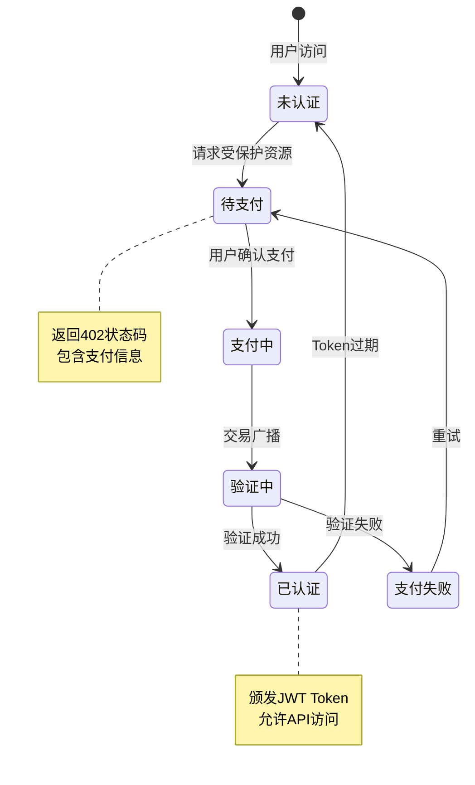
```mermaid
stateDiagram-v2
    [*] --> 未认证: 用户访问
    未认证 --> 待支付: 请求受保护资源
    待支付 --> 支付中: 用户确认支付
    支付中 --> 验证中: 交易广播
    验证中 --> 已认证: 验证成功
    验证中 --> 支付失败: 验证失败
    支付失败 --> 待支付: 重试
    已认证 --> 未认证: Token过期
    
    note right of 待支付
        返回402状态码
        包含支付信息
    end note
    
    note right of 已认证
        颁发JWT Token
        允许API访问
    end note
```

### 多链支付支持架构

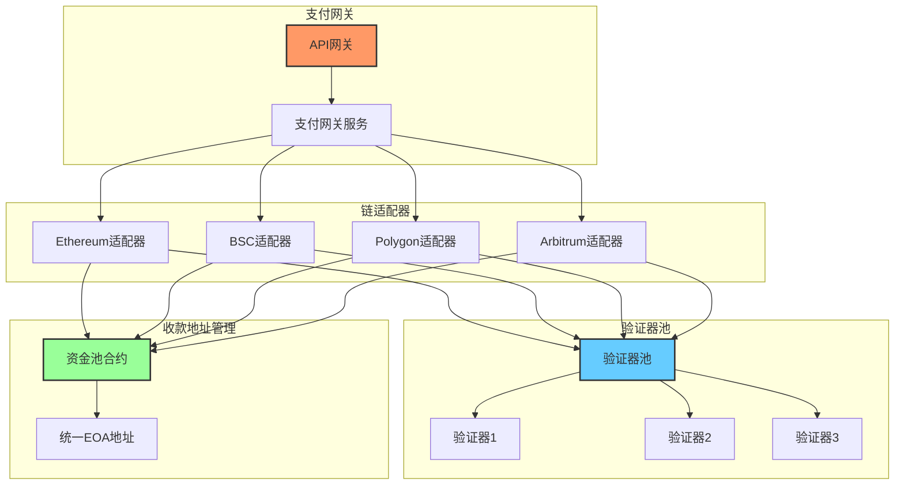
```mermaid
graph TB
    subgraph "支付网关"
        GW[API网关]
        PG[支付网关服务]
    end

    subgraph "链适配器"
        ETH[Ethereum适配器]
        BSC[BSC适配器]
        POLY[Polygon适配器]
        ARB[Arbitrum适配器]
    end

    subgraph "验证器池"
        VP[验证器池]
        V1[验证器1]
        V2[验证器2]
        V3[验证器3]
    end

    subgraph "收款地址管理"
        TRE[资金池合约]
        EOA[统一EOA地址]
    end

    GW --> PG
    PG --> ETH
    PG --> BSC
    PG --> POLY
    PG --> ARB
    
    ETH --> VP
    BSC --> VP
    POLY --> VP
    ARB --> VP
    
    VP --> V1
    VP --> V2
    VP --> V3
    
    ETH --> TRE
    BSC --> TRE
    POLY --> TRE
    ARB --> TRE
    
    TRE --> EOA
    
    style GW fill:#f96,stroke:#333,stroke-width:2px
    style VP fill:#6cf,stroke:#333,stroke-width:2px
    style TRE fill:#9f9,stroke:#333,stroke-width:2px
```

### ERC-20代币支付流程

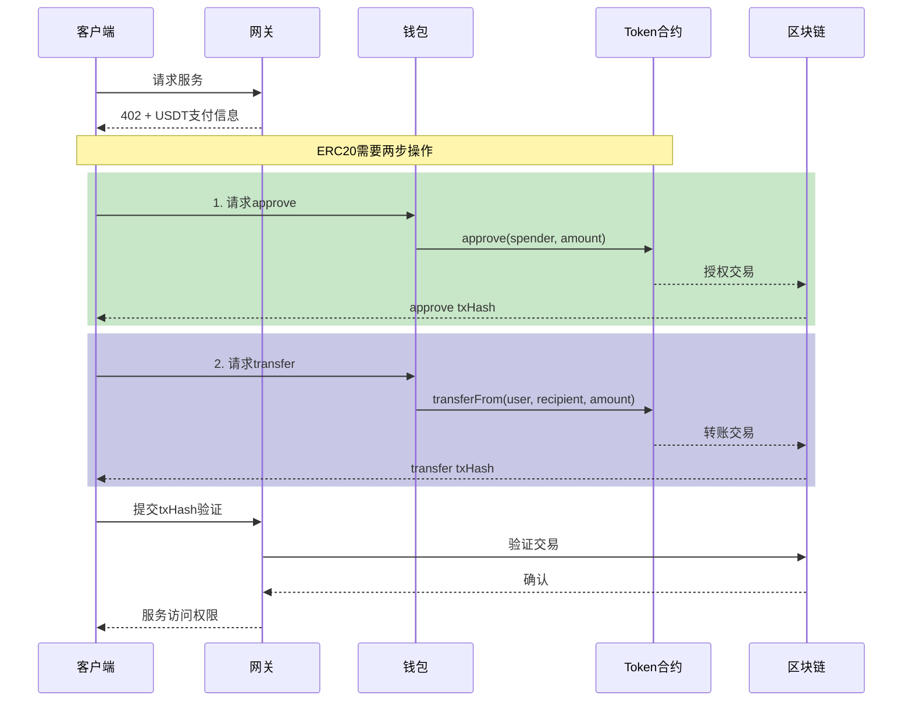
```mermaid
sequenceDiagram
    participant C as 客户端
    participant GW as 网关
    participant W as 钱包
    participant TOKEN as Token合约
    participant BC as 区块链

    C->>GW: 请求服务
    GW-->>C: 402 + USDT支付信息
    
    Note over C,TOKEN: ERC20需要两步操作
    
    rect rgb(200, 230, 200)
        C->>W: 1. 请求approve
        W->>TOKEN: approve(spender, amount)
        TOKEN-->>BC: 授权交易
        BC-->>C: approve txHash
    end
    
    rect rgb(200, 200, 230)
        C->>W: 2. 请求transfer
        W->>TOKEN: transferFrom(user, recipient, amount)
        TOKEN-->>BC: 转账交易
        BC-->>C: transfer txHash
    end
    
    C->>GW: 提交txHash验证
    GW->>BC: 验证交易
    BC-->>GW: 确认
    GW-->>C: 服务访问权限
```

### 签名支付（EIP-712）优化方案

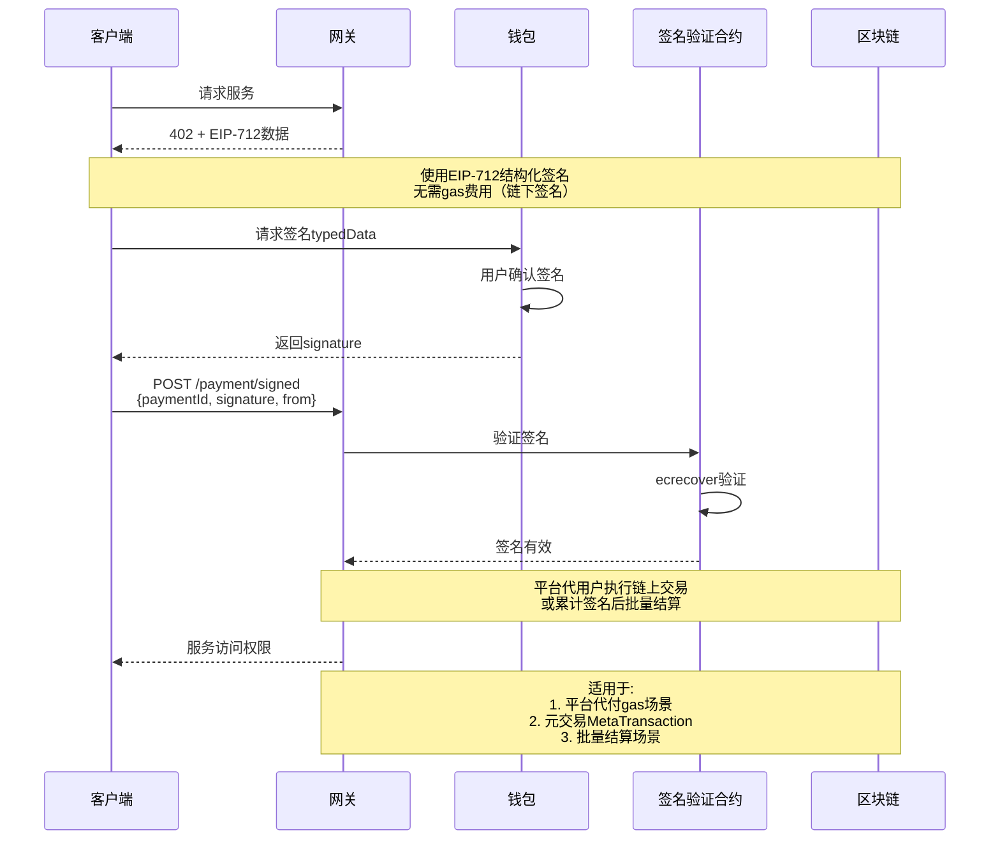
```mermaid
sequenceDiagram
    participant C as 客户端
    participant GW as 网关
    participant W as 钱包
    participant SIG as 签名验证合约
    participant BC as 区块链

    C->>GW: 请求服务
    GW-->>C: 402 + EIP-712数据
    
    Note over C,BC: 使用EIP-712结构化签名<br/>无需gas费用（链下签名）
    
    C->>W: 请求签名typedData
    W->>W: 用户确认签名
    W-->>C: 返回signature
    
    C->>GW: POST /payment/signed<br/>{paymentId, signature, from}
    GW->>SIG: 验证签名
    SIG->>SIG: ecrecover验证
    SIG-->>GW: 签名有效
    
    Note over GW,BC: 平台代用户执行链上交易<br/>或累计签名后批量结算
    
    GW-->>C: 服务访问权限
    
    Note over GW,BC: 适用于:<br/>1. 平台代付gas场景<br/>2. 元交易MetaTransaction<br/>3. 批量结算场景
```

### 系统组件架构

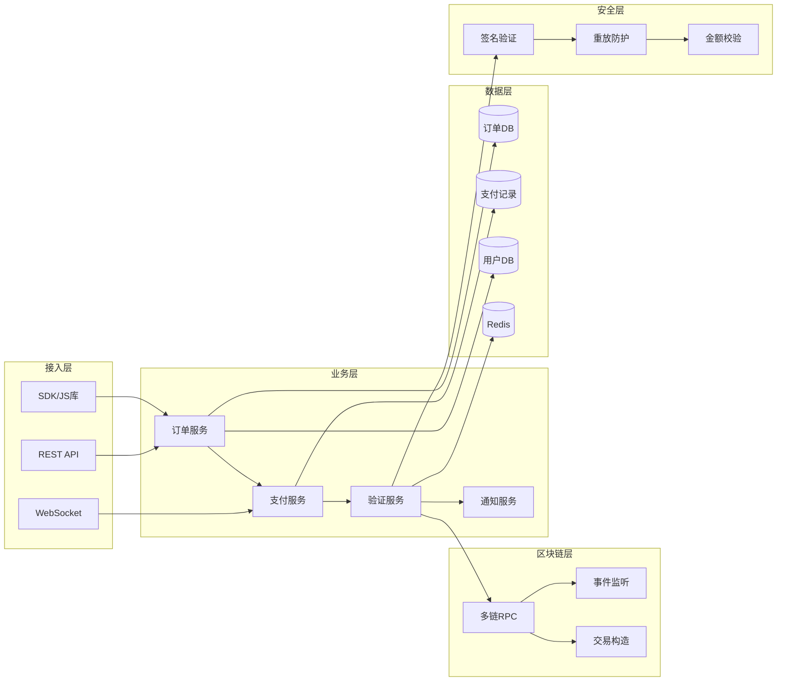
```mermaid
graph LR
    subgraph "接入层"
        A1[REST API]
        A2[WebSocket]
        A3[SDK/JS库]
    end

    subgraph "业务层"
        B1[订单服务]
        B2[支付服务]
        B3[验证服务]
        B4[通知服务]
    end

    subgraph "数据层"
        C1[(订单DB)]
        C2[(支付记录)]
        C3[(用户DB)]
        C4[(Redis)]
    end

    subgraph "区块链层"
        D1[多链RPC]
        D2[事件监听]
        D3[交易构造]
    end

    subgraph "安全层"
        E1[签名验证]
        E2[重放防护]
        E3[金额校验]
    end

    A1 --> B1
    A2 --> B2
    A3 --> B1
    
    B1 --> B2
    B2 --> B3
    B3 --> B4
    
    B1 --> C1
    B2 --> C2
    B1 --> C3
    B3 --> C4
    
    B3 --> D1
    D1 --> D2
    D1 --> D3
    
    B3 --> E1
    E1 --> E2
    E2 --> E3
```

### 关键特性

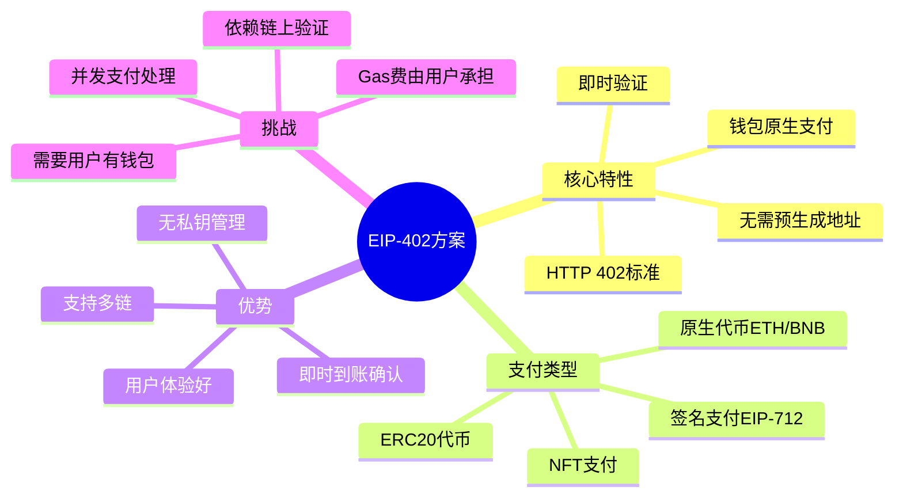
```mermaid
mindmap
  root((EIP-402方案))
    核心特性
      HTTP 402标准
      钱包原生支付
      即时验证
      无需预生成地址
    支付类型
      原生代币ETH/BNB
      ERC20代币
      NFT支付
      签名支付EIP-712
    优势
      用户体验好
      无私钥管理
      即时到账确认
      支持多链
    挑战
      需要用户有钱包
      Gas费由用户承担
      依赖链上验证
      并发支付处理
```

### 防重放攻击机制

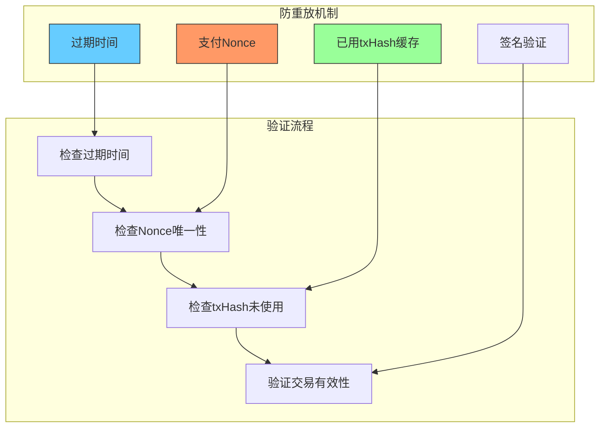
```mermaid
graph TB
    subgraph "防重放机制"
        NONCE[支付Nonce]
        EXPIRY[过期时间]
        USED[已用txHash缓存]
        SIG[签名验证]
    end

    subgraph "验证流程"
        V1[检查过期时间]
        V2[检查Nonce唯一性]
        V3[检查txHash未使用]
        V4[验证交易有效性]
    end

    V1 --> V2 --> V3 --> V4
    
    NONCE --> V2
    EXPIRY --> V1
    USED --> V3
    SIG --> V4
    
    style NONCE fill:#f96,stroke:#333
    style EXPIRY fill:#6cf,stroke:#333
    style USED fill:#9f9,stroke:#333
```

---

## 方案对比

### 三种方案架构对比

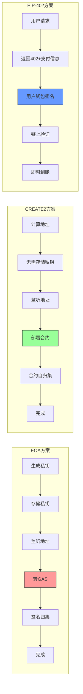
```mermaid
graph LR
    subgraph "EOA方案"
        E1[生成私钥] --> E2[存储私钥]
        E2 --> E3[监听地址]
        E3 --> E4[转GAS]
        E4 --> E5[签名归集]
        E5 --> E6[完成]
    end

    subgraph "CREATE2方案"
        C1[计算地址] --> C2[无需存储私钥]
        C2 --> C3[监听地址]
        C3 --> C4[部署合约]
        C4 --> C5[合约自归集]
        C5 --> C6[完成]
    end

    subgraph "EIP-402方案"
        P1[用户请求] --> P2[返回402+支付信息]
        P2 --> P3[用户钱包签名]
        P3 --> P4[链上验证]
        P4 --> P5[即时到账]
    end
    
    style E4 fill:#f99,stroke:#333
    style C4 fill:#9f9,stroke:#333
    style P3 fill:#69f,stroke:#333
```

### 详细对比表（三种方案）

| 维度 | EOA地址方案 | CREATE2合约方案 | EIP-402支付协议方案 |
|------|------------|----------------|-------------------|
| **地址生成** | 需要生成和存储私钥 | 只需计算，无需部署 | 无需生成，使用平台统一地址 |
| **私钥管理** | 需要安全存储大量私钥 | 只需管理Factory合约 | 无私钥管理负担 |
| **GAS费用** | 归集前需转入GAS | 从用户资金中扣除 | 用户自行承担 |
| **归集复杂度** | 需要逐个签名交易 | 合约批量归集 | 无需归集，直接到账 |
| **资金到账** | 需等待归集 | 需等待归集 | 即时到账 |
| **用户体验** | 一般，需要复制地址 | 一般，需要复制地址 | 优秀，钱包原生交互 |
| **安全性** | 私钥泄露风险 | 合约漏洞风险 | 依赖用户钱包安全 |
| **适用场景** | 交易所充值 | 交易所充值 | 服务付费/即时支付 |
| **适用链** | 所有EVM链 | 仅支持CREATE2的链 | 所有支持钱包的链 |
| **开发复杂度** | 较低 | 较高 | 中等 |
| **资金效率** | 需预留GAS | 资金利用率更高 | 最高，无额外成本 |
| **可审计性** | 交易记录清晰 | 合约调用记录 | HTTP请求+链上交易 |
| **最小金额限制** | 需考虑GAS成本 | 需考虑部署成本 | 无限制 |
| **并发处理** | 需要队列管理 | 需要队列管理 | 天然支持并发 |
| **用户门槛** | 低，任何地址可转 | 低，任何地址可转 | 中，需要有钱包 |

### 多链支持对比

```mermaid
graph LR
    subgraph "EOA方案支持"
        E_EVM[EVM链: ✅ 完全支持]
        E_TRON[TRON: ✅ 完全支持]
        E_SOL[Solana: ✅ 完全支持]
        E_OTHER[其他链: ✅ 完全支持]
    end

    subgraph "CREATE2方案支持"
        C_EVM[EVM链: ✅ 完全支持]
        C_TRON[TRON: ⚠️ 部分支持]
        C_SOL[Solana: ❌ 不支持]
        C_OTHER[其他链: ⚠️ 视链而定]
    end

    subgraph "EIP-402方案支持"
        P_EVM[EVM链: ✅ 完全支持]
        P_TRON[TRON: ✅ 支持]
        P_SOL[Solana: ✅ 支持]
        P_OTHER[其他链: ✅ 支持]
    end

    style E_EVM fill:#9f9,stroke:#333
    style E_TRON fill:#9f9,stroke:#333
    style E_SOL fill:#9f9,stroke:#333
    style E_OTHER fill:#9f9,stroke:#333
    
    style C_EVM fill:#9f9,stroke:#333
    style C_TRON fill:#ff9,stroke:#333
    style C_SOL fill:#f99,stroke:#333
    style C_OTHER fill:#ff9,stroke:#333
    
    style P_EVM fill:#9f9,stroke:#333
    style P_TRON fill:#9f9,stroke:#333
    style P_SOL fill:#9f9,stroke:#333
    style P_OTHER fill:#9f9,stroke:#333
```

### 各链技术支持详情

| 区块链 | EOA方案 | CREATE2方案 | EIP-402方案 | 备注 |
|--------|---------|-------------|-------------|------|
| **Ethereum** | ✅ 完全支持 | ✅ 完全支持 | ✅ 完全支持 | EVM原生支持 |
| **BSC** | ✅ 完全支持 | ✅ 完全支持 | ✅ 完全支持 | EVM兼容 |
| **Polygon** | ✅ 完全支持 | ✅ 完全支持 | ✅ 完全支持 | EVM兼容 |
| **Arbitrum** | ✅ 完全支持 | ✅ 完全支持 | ✅ 完全支持 | EVM兼容 |
| **Optimism** | ✅ 完全支持 | ✅ 完全支持 | ✅ 完全支持 | EVM兼容 |
| **Avalanche** | ✅ 完全支持 | ✅ 完全支持 | ✅ 完全支持 | EVM兼容 |
| **Base** | ✅ 完全支持 | ✅ 完全支持 | ✅ 完全支持 | EVM兼容 |
| **TRON** | ✅ 完全支持 | ⚠️ 需适配 | ✅ 支持 | 使用不同的地址格式(Base58) |
| **Solana** | ✅ 完全支持 | ❌ 不支持 | ✅ 支持 | 非EVM，无CREATE2 |
| **Bitcoin** | ✅ 完全支持 | ❌ 不支持 | ⚠️ 有限支持 | UTXO模型，无智能合约 |
| **Ton** | ✅ 完全支持 | ⚠️ 需适配 | ✅ 支持 | 有合约，但非EVM |
| **Near** | ✅ 完全支持 | ⚠️ 需适配 | ✅ 支持 | 有合约，但非EVM |
| **Cosmos** | ✅ 完全支持 | ❌ 不支持 | ✅ 支持 | 无智能合约部署 |

**图例说明：**
- ✅ 完全支持：方案可以直接在该链上实现
- ⚠️ 需适配/有限支持：需要针对该链特性进行适配开发
- ❌ 不支持：该链不支持此方案的核心技术

### TRON网络特殊说明

```mermaid
graph TB
    subgraph "TRON网络特性"
        T1[地址格式: Base58编码<br/>T开头地址]
        T2[能量模型: Energy + Bandwidth]
        T3[合约创建: 支持类似CREATE2]
        T4[资源租赁: 可租赁Energy]
    end

    subgraph "EOA方案适配"
        TE1[HD派生: ✅ 支持<br/>路径: m/44'/195'/0'/0/i]
        TE2[归集: ✅ 支持<br/>需转Energy/Bandwidth]
    end

    subgraph "CREATE2方案适配"
        TC1[地址预计算: ⚠️ 需适配<br/>使用txId预测]
        TC2[合约部署: ✅ 支持<br/>但实现方式不同]
    end

    subgraph "EIP-402方案适配"
        TP1[支付验证: ✅ 支持]
        TP2[钱包集成: ✅ TronLink等]
    end

    T1 --> TE1
    T2 --> TE2
    T3 --> TC2
    T4 --> TE2
    T1 --> TP1

    style T1 fill:#ff9,stroke:#333
    style T2 fill:#ff9,stroke:#333
    style T3 fill:#9f9,stroke:#333
    style T4 fill:#9f9,stroke:#333
```

**TRON关键技术点：**
| 特性 | Ethereum | TRON | 影响 |
|------|----------|------|------|
| 地址格式 | 0x开头，20字节 | T开头，Base58 | 需要地址转换逻辑 |
| 派生路径 | m/44'/60'/0'/0/i | m/44'/195'/0'/0/i | 需要不同路径 |
| 资源模型 | Gas | Energy + Bandwidth | 归集成本计算不同 |
| CREATE2等价 | 支持 | 支持但实现不同 | 需要适配代码 |
| 签名算法 | ECDSA (secp256k1) | 相同 | 可复用 |

### Solana网络特殊说明

```mermaid
graph TB
    subgraph "Solana网络特性"
        S1[账户模型: 不同类型账户]
        S2[租金机制: Rent豁免]
        S3[程序部署: BPF字节码]
        S4[无CREATE2: 使用PDA]
    end

    subgraph "EOA方案适配"
        SE1[密钥派生: ✅ 支持<br/>Ed25519曲线]
        SE2[归集: ✅ 支持<br/>需SOL作为租金]
    end

    subgraph "CREATE2方案替代"
        SC1[PDA: ✅ 可替代<br/>程序派生地址]
        SC2[实现复杂: ⚠️ 需重写]
    end

    subgraph "EIP-402方案适配"
        SP1[支付验证: ✅ 支持]
        SP2[钱包集成: ✅ Phantom等]
    end

    S1 --> SE1
    S2 --> SE2
    S3 --> SC2
    S4 --> SC1
    S1 --> SP1

    style S1 fill:#ff9,stroke:#333
    style S2 fill:#ff9,stroke:#333
    style S3 fill:#f96,stroke:#333
    style S4 fill:#6cf,stroke:#333
```

**Solana关键技术点：**
| 特性 | Ethereum | Solana | 影响 |
|------|----------|--------|------|
| 签名算法 | ECDSA (secp256k1) | Ed25519 | 需要不同的签名库 |
| 地址长度 | 20字节 | 32字节 | 需要调整存储 |
| 智能合约 | EVM字节码 | BPF程序 | 完全不同 |
| CREATE2 | 原生支持 | 使用PDA(Program Derived Address) | 可替代但需重写 |
| Gas/费用 | Gas | 计算单元+租金 | 成本模型不同 |

### 多链架构适配建议

```mermaid
graph TB
    subgraph "通用适配层"
        ADAPTER[链适配器接口]
        ADDR[地址管理器]
        SIGN[签名管理器]
        TX[交易构造器]
        VERIFY[验证器]
    end

    subgraph "EVM链实现"
        ETH_ADAPTER[Ethereum适配器]
        ETH_ADDR[0x地址格式]
        ETH_SIGN[ECDSA签名]
        ETH_TX[EVM交易]
    end

    subgraph "TRON实现"
        TRON_ADAPTER[TRON适配器]
        TRON_ADDR[Base58地址]
        TRON_SIGN[ECDSA签名]
        TRON_TX[TRON交易]
    end

    subgraph "Solana实现"
        SOL_ADAPTER[Solana适配器]
        SOL_ADDR[Base58/32字节]
        SOL_SIGN[Ed25519签名]
        SOL_TX[Solana交易]
    end

    ADAPTER --> ETH_ADAPTER
    ADAPTER --> TRON_ADAPTER
    ADAPTER --> SOL_ADAPTER

    ADDR --> ETH_ADDR
    ADDR --> TRON_ADDR
    ADDR --> SOL_ADDR

    SIGN --> ETH_SIGN
    SIGN --> TRON_SIGN
    SIGN --> SOL_SIGN

    TX --> ETH_TX
    TX --> TRON_TX
    TX --> SOL_TX

    style ADAPTER fill:#f9f,stroke:#333,stroke-width:2px
    style ETH_ADAPTER fill:#9f9,stroke:#333
    style TRON_ADAPTER fill:#ff9,stroke:#333
    style SOL_ADAPTER fill:#6cf,stroke:#333
```

### 基于链的方案推荐

```mermaid
graph TD
    START[选择方案] --> Q1{需要支持哪些链?}
    
    Q1 -->|仅EVM链| Q2{用户规模?}
    Q1 -->|EVM + TRON| Q3{TRON用户占比?}
    Q1 -->|EVM + Solana| Q4{CREATE2需求?}
    Q1 -->|全链支持| EOA[EOA方案]
    
    Q2 -->|大规模| CREATE2[CREATE2方案]
    Q2 -->|小规模| EOA
    
    Q3 -->|高| EOA
    Q3 -->|低| CREATE2
    
    Q4 -->|是| Q5{能否接受Solana用EOA?}
    Q4 -->|否| EOA
    
    Q5 -->|是| HYBRID[混合方案]
    Q5 -->|否| EOA
    
    style EOA fill:#6cf,stroke:#333,stroke-width:2px
    style CREATE2 fill:#9f9,stroke:#333,stroke-width:2px
    style HYBRID fill:#f9f,stroke:#333,stroke-width:2px
```

**多链支持建议：**

| 需求场景 | 推荐方案 | 理由 |
|---------|---------|------|
| 仅支持EVM链 | CREATE2 | 技术最优，资金效率高 |
| EVM + TRON（小规模） | EOA | 统一实现，维护成本低 |
| EVM + TRON（大规模） | 混合方案 | EVM用CREATE2，TRON用EOA |
| EVM + Solana | 混合方案 | EVM用CREATE2，Solana用EOA |
| 需要支持所有主流链 | EOA | 兼容性最好，一套方案适配所有 |
| 服务付费场景 | EIP-402 | 不依赖链特性，通用性好 |

### 适用场景对比

```mermaid
mindmap
  root((方案选择))
    EOA方案
      适用场景
        中心化交易所
        大规模用户充值
        需要多链支持
      核心考量
        私钥安全管理
        GAS成本优化
        归集效率
    CREATE2方案
      适用场景
        DEX/DeFi平台
        高级资金管理
        智能合约交互
      核心考量
        合约安全审计
        部署成本控制
        链兼容性
    EIP-402方案
      适用场景
        API服务付费
        订阅制服务
        一次性支付
        链上服务调用
      核心考量
        钱包集成
        验证延迟
        重放攻击防护
```

### 资金流向对比

```mermaid
graph TB
    subgraph "EOA方案资金流"
        EU1[用户] -->|转账| EA1[用户充值地址]
        EA1 -->|归集| EH1[热钱包]
        EH1 -->|大额转出| EC1[冷钱包]
    end

    subgraph "CREATE2方案资金流"
        CU1[用户] -->|转账| CA1[预计算合约地址]
        CA1 -->|部署后归集| CT1[资金池合约]
        CT1 -->|转出| CC1[冷钱包]
    end

    subgraph "EIP-402方案资金流"
        PU1[用户钱包] -->|直接转账| PT1[平台收款地址]
        PT1 -->|监控确认| PS1[结算服务]
    end

    style EA1 fill:#f96,stroke:#333
    style CA1 fill:#6cf,stroke:#333
    style PT1 fill:#9f9,stroke:#333
```

### 成本分析

```mermaid
graph LR
    subgraph "EOA成本"
        E1[地址管理成本] --> E2[GAS预转成本]
        E2 --> E3[归集交易成本]
        E3 --> E4[私钥存储成本]
    end

    subgraph "CREATE2成本"
        C1[合约开发成本] --> C2[合约部署成本]
        C2 --> C3[归集调用成本]
    end

    subgraph "EIP-402成本"
        P1[验证服务成本] --> P2[多链RPC成本]
        P2 --> P3[网关维护成本]
    end

    style E4 fill:#f99,stroke:#333
    style C1 fill:#f96,stroke:#333
    style P3 fill:#9f9,stroke:#333
```

### 关键注意事项

```mermaid
mindmap
  root((方案选择))
    EOA方案
      优点
        实现简单
        兼容性好
        调试方便
        用户无门槛
      缺点
        私钥管理复杂
        需预转GAS
        归集效率低
        小额资金不划算
    CREATE2方案
      优点
        无需存储私钥
        无需预转GAS
        批量归集高效
        资金利用率高
      缺点
        合约开发复杂
        部署有成本
        链兼容性要求
        需要合约审计
    EIP-402方案
      优点
        无需归集
        即时到账确认
        用户体验最佳
        天然支持并发
      缺点
        需要用户有钱包
        Gas费由用户承担
        依赖链上验证延迟
        需防重放攻击
```

### Ethereum SELFDESTRUCT 变更说明

> **重要提示**: 从EIP-6780 (Cancun升级) 开始，`SELFDESTRUCT`操作码的行为已改变：
> - 只有在同一交易中创建的合约才能完全自毁
> - 其他情况下只删除存储和代码，不退还GAS
> - 这影响了CREATE2方案"销毁合约返回GAS"的原有优势

```mermaid
graph LR
    A[EIP-6780前] -->|SELFDESTRUCT| B[销毁合约+退GAS]
    C[EIP-6780后] -->|SELFDESTRUCT| D[仅删除存储<br/>不退GAS]
    
    style B fill:#9f9,stroke:#333
    style D fill:#f99,stroke:#333
```

---

## 推荐方案

### 决策树（三种方案）

```mermaid
graph TD
    START[选择方案] --> Q1{业务类型?}
    
    Q1 -->|交易所/充值| Q2{用户规模?}
    Q1 -->|服务付费/API| Q3{用户有钱包?}
    Q1 -->|混合场景| HYBRID[混合方案]
    
    Q2 -->|小规模<1万| EOA[EOA方案]
    Q2 -->|大规模>1万| Q4{支持的链?}
    
    Q4 -->|仅主流EVM| Q5{预算?}
    Q4 -->|多链支持| EOA
    
    Q5 -->|充足| CREATE2[CREATE2方案]
    Q5 -->|有限| EOA
    
    Q3 -->|是| Q6{即时验证需求?}
    Q3 -->|否| Q7{愿集成钱包?}
    
    Q6 -->|是| EIP402[EIP-402方案]
    Q6 -->|否| Q8{归集频率?}
    
    Q8 -->|低| EOA
    Q8 -->|高| CREATE2
    
    Q7 -->|是| EIP402
    Q7 -->|否| EOA
    
    style EOA fill:#6cf,stroke:#333,stroke-width:2px
    style CREATE2 fill:#9f9,stroke:#333,stroke-width:2px
    style EIP402 fill:#f9f,stroke:#333,stroke-width:2px
    style HYBRID fill:#c9f,stroke:#333,stroke-width:2px
```

### 场景推荐表

| 业务场景 | 推荐方案 | 备选方案 | 说明 |
|---------|---------|---------|------|
| 中心化交易所 | EOA | CREATE2 | 用户量大，需要稳定可靠 |
| DEX/DeFi平台 | CREATE2 | EOA | 智能合约原生集成 |
| API服务付费 | EIP-402 | - | 即时验证，即时开通 |
| 订阅制服务 | EIP-402 | EOA | 周期性支付验证 |
| NFT市场 | EIP-402 | CREATE2 | 钱包原生交互体验好 |
| GameFi应用 | EIP-402 | CREATE2 | 游戏内支付场景 |
| 跨境支付平台 | EIP-402 | EOA | 一次性支付即时确认 |
| 企业级钱包 | CREATE2 | EOA | 高级资金管理需求 |
| 多链DEX | EOA | - | 兼容性优先 |
| 小型DApp | EIP-402 | EOA | 开发成本低 |

### 混合方案架构

对于复杂业务场景，可以采用混合方案：

```mermaid
graph TB
    subgraph "混合架构"
        subgraph "充值入口"
            CE[CEX充值: EOA/CREATE2]
            DE[DeFi充值: CREATE2]
            PE[支付入口: EIP-402]
        end
        
        subgraph "统一资金管理"
            AGG[聚合服务]
            TRE[统一资金池]
            SET[结算服务]
        end
        
        subgraph "监控与风控"
            MON[统一监控]
            RISK[风控系统]
            AUDIT[审计系统]
        end
    end

    CE --> AGG
    DE --> AGG
    PE --> AGG
    
    AGG --> TRE
    TRE --> SET
    
    AGG --> MON
    MON --> RISK
    RISK --> AUDIT
    
    style AGG fill:#f9f,stroke:#333,stroke-width:2px
    style TRE fill:#9f9,stroke:#333,stroke-width:2px
```

### 技术栈建议

```mermaid
mindmap
  root((技术选型))
    EOA方案
      密钥管理: Vault/HSM
      派生: BIP32/BIP44
      扫描: 区块扫描器
      归集: 批量签名器
    CREATE2方案
      合约: Solidity
      预计算: ethers.js/web3.py
      部署: Hardhat/Foundry
      归集: 合约调用
    EIP-402方案
      网关: Nginx/APISIX
      验证: 多链RPC
      签名: EIP-712
      缓存: Redis
```

---

## 文件结构建议

### 完整项目结构

```
wallet/
├── cmd/
│   ├── server/
│   │   └── main.go              # 服务入口
│   └── cli/
│       └── main.go              # CLI工具入口
│
├── internal/
│   ├── api/
│   │   ├── handler/
│   │   │   ├── eoa.go          # EOA相关API
│   │   │   ├── create2.go      # CREATE2相关API
│   │   │   └── payment.go      # EIP-402支付API
│   │   ├── middleware/
│   │   │   ├── auth.go         # 认证中间件
│   │   │   ├── payment402.go   # 402支付中间件
│   │   │   └── ratelimit.go    # 限流中间件
│   │   └── router.go           # 路由配置
│   │
│   ├── wallet/
│   │   ├── eoa/
│   │   │   ├── generator.go    # EOA地址生成
│   │   │   ├── derive.go       # HD钱包派生
│   │   │   └── collector.go    # EOA归集服务
│   │   ├── create2/
│   │   │   ├── predictor.go    # CREATE2地址预计算
│   │   │   ├── deployer.go     # 合约部署器
│   │   │   └── collector.go    # 合约归集服务
│   │   └── common/
│   │       ├── signer.go       # 交易签名器
│   │       └── broadcaster.go  # 交易广播器
│   │
│   ├── payment/
│   │   ├── gateway.go          # 支付网关
│   │   ├── verifier/
│   │   │   ├── chain.go        # 链上验证器
│   │   │   ├── signature.go    # 签名验证器
│   │   │   └── replay.go       # 重放攻击防护
│   │   ├── order/
│   │   │   ├── manager.go      # 订单管理
│   │   │   └── status.go       # 订单状态机
│   │   └── auth/
│   │       ├── token.go        # JWT Token管理
│   │       └── session.go      # 会话管理
│   │
│   ├── monitor/
│   │   ├── scanner/
│   │   │   ├── block.go        # 区块扫描器
│   │   │   └── transaction.go  # 交易扫描器
│   │   ├── watcher/
│   │   │   ├── address.go      # 地址监听
│   │   │   └── event.go        # 事件监听
│   │   └── notifier/
│   │       ├── webhook.go      # Webhook通知
│   │       └── websocket.go    # WebSocket推送
│   │
│   ├── chain/
│   │   ├── client/
│   │   │   ├── ethereum.go     # Ethereum客户端
│   │   │   ├── bsc.go          # BSC客户端
│   │   │   └── polygon.go      # Polygon客户端
│   │   ├── adapter/
│   │   │   ├── interface.go    # 链适配器接口
│   │   │   └── factory.go      # 链适配器工厂
│   │   └── config/
│   │       └── chains.yaml     # 链配置文件
│   │
│   ├── kms/
│   │   ├── vault.go            # HashiCorp Vault集成
│   │   ├── hsm.go              # HSM集成
│   │   └── encrypt.go          # 加密工具
│   │
│   └── storage/
│       ├── postgres/
│       │   ├── repository.go   # 数据仓库
│       │   └── models.go       # 数据模型
│       └── redis/
│           ├── cache.go        # 缓存服务
│           └── queue.go        # 消息队列
│
├── contracts/
│   ├── factory/
│   │   ├── Factory.sol         # CREATE2 Factory合约
│   │   └── IFactory.sol        # Factory接口
│   ├── proxy/
│   │   ├── ProxyWallet.sol     # Proxy钱包合约
│   │   └── IProxyWallet.sol    # Proxy接口
│   ├── treasury/
│   │   └── Treasury.sol        # 资金池合约
│   ├── payment/
│   │   └── PaymentReceiver.sol # 支付接收合约
│   └── libraries/
│       └── AddressPredictor.sol# 地址预测库
│
├── pkg/
│   ├── crypto/
│   │   ├── eip712.go           # EIP-712签名
│   │   ├── eip191.go           # EIP-191签名
│   │   └── address.go          # 地址工具
│   ├── utils/
│   │   ├── hash.go             # 哈希工具
│   │   └── amount.go           # 金额转换
│   └── types/
│       ├── payment.go          # 支付类型定义
│       └── chain.go            # 链类型定义
│
├── sdk/
│   ├── js/
│   │   ├── src/
│   │   │   ├── payment.ts      # 前端支付SDK
│   │   │   └── types.ts        # 类型定义
│   │   ├── package.json
│   │   └── tsconfig.json
│   └── go/
│       ├── client.go           # Go SDK客户端
│       └── payment.go          # Go支付模块
│
├── deployments/
│   ├── docker/
│   │   ├── Dockerfile
│   │   └── docker-compose.yaml
│   └── k8s/
│       ├── deployment.yaml
│       └── service.yaml
│
├── docs/
│   ├── architecture.md         # 架构文档
│   ├── api.md                  # API文档
│   └── contracts.md            # 合约文档
│
├── scripts/
│   ├── deploy.sh               # 部署脚本
│   └── migrate.sh              # 迁移脚本
│
├── test/
│   ├── integration/            # 集成测试
│   └── e2e/                    # 端到端测试
│
├── go.mod
├── go.sum
├── Makefile
└── README.md
```

### 核心模块说明

| 模块 | 说明 | 相关方案 |
|------|------|---------|
| `internal/wallet/eoa` | EOA地址生成与归集 | EOA方案 |
| `internal/wallet/create2` | CREATE2地址预计算与部署 | CREATE2方案 |
| `internal/payment` | EIP-402支付网关与验证 | EIP-402方案 |
| `internal/kms` | 密钥管理与加密 | EOA方案 |
| `internal/chain` | 多链客户端与适配器 | 所有方案 |
| `internal/monitor` | 区块扫描与事件监听 | 所有方案 |
| `contracts/` | 智能合约 | CREATE2/EIP-402方案 |
| `sdk/` | 前端/客户端SDK | EIP-402方案 |
